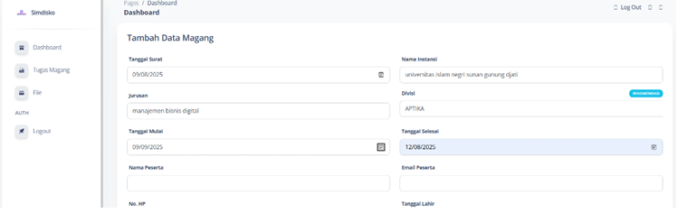

# 🚀 Internship Management System (Laravel)

## 📌 Overview

This project is a web-based internship management system built using Laravel.
It helps manage internship applications, data processing, and integrates with a Machine Learning API to provide **automatic internship division recommendations**.

---

## 🤖 Machine Learning Integration

This system integrates with a separate Machine Learning API built using Python Flask and K-Nearest Neighbor (KNN).

👉 ML Repository:
https://github.com/USERNAME/knn-api-recommendation

---

## 🔄 System Flow

1. User submits internship application data
2. Laravel backend sends request to ML API
3. ML API processes data using KNN model
4. Recommended division is returned
5. Result is stored and displayed to user

---

## 🚀 Features

* Internship application management
* CRUD data management
* REST API integration
* Machine learning-based recommendation
* Clean and structured Laravel architecture

---

## 🛠️ Tech Stack

* **Backend:** Laravel
* **Database:** MySQL
* **ML API:** Python Flask
* **Algorithm:** K-Nearest Neighbor (KNN)

---

## 🔌 API Integration

Laravel communicates with the ML API:

```
POST http://127.0.0.1:5000/predict
```

---

## 📤 Example Response

```
{
  "success": true,
  "predicted_divisi": "APTIKA",
  "confidence": 0.5
}
```

---

## 💻 Integration Example

```php
use Illuminate\Support\Facades\Http;

$response = Http::post('http://127.0.0.1:5000/predict', [
    "jurusan" => $request->jurusan,
    "mapel1" => $request->mapel1,
    "mapel2" => $request->mapel2,
    "skill_teknis" => $request->skill_teknis,
    "sertifikasi" => $request->sertifikasi,
    "proyek" => $request->proyek,
    "tanggal_mulai" => $request->tanggal_mulai,
    "tanggal_akhir" => $request->tanggal_akhir
]);

$result = $response->json();
$divisi = $result['predicted_divisi'];
```

---

## ⚙️ Installation

```bash
git clone https://github.com/USERNAME/internship-system-laravel.git
cd internship-system-laravel
composer install
cp .env.example .env
php artisan key:generate
php artisan migrate
```

---

## ▶️ Run Project

```bash
php artisan serve
```

---

## 📸 Preview
Dashboard - Input Data Magang
User interface for managing internship data including participant information and division selection.



---

## 👩‍💻 Author

Silvy Putri
